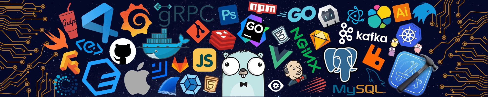

 
  

   
  

# 👋 关于我
- 你好, 我是 Sage 🏆
- 普通软件工程本科生，喜欢网络安全.📋 
- 开发和渗透测试两把抓.👊

<h2>Github 状态图 </h2> 

  

<!-- align="center" -->
<h2>🧐渗透测试工具</h2>

	
	
	
	

<h2>🔧 语言和工具</h2>
  

      <a href="" target="_blank"> 
      <a href="" target="_blank">  
      <a href="" target="_blank"> 
      
      
      <a href="" target="_blank"> 
      <a href="" target="_blank"> 
      <a href="" target="_blank"> 
      <a href="" target="_blank"> 
      <a href="" target="_blank">  
      <a href="" target="_blank"> 
      
     
 

<h2>💻 IDE (集成开发环境)</h2>

	
	
	
	
	
	
	<a href="" target="_blank"> 
	
	
	
	
	
	
        

	
<h2>  浏览量 </h2>
  
本部分的访问者统计从 2024 年 7 月 30 日开始

 

  <h2> 常用语言分布图 </h2> 

    

<h2>GitHub 活动</h2> 
  

	

<h2>Wakatime 分析</h2> 

    

 

<!-- 

  
<h2>浏览量 </h2>

  
本部分的访问者统计从 2024 年 7 月 30 日开始

 

  
<h2>常用语言分布图</h2> 

    

 
  
<h2>Github 状态图</h2>

  

  
<h2>Wakatime 分析</h2> 

    

<h2>GitHub 活动</h2>

  

	

-->
